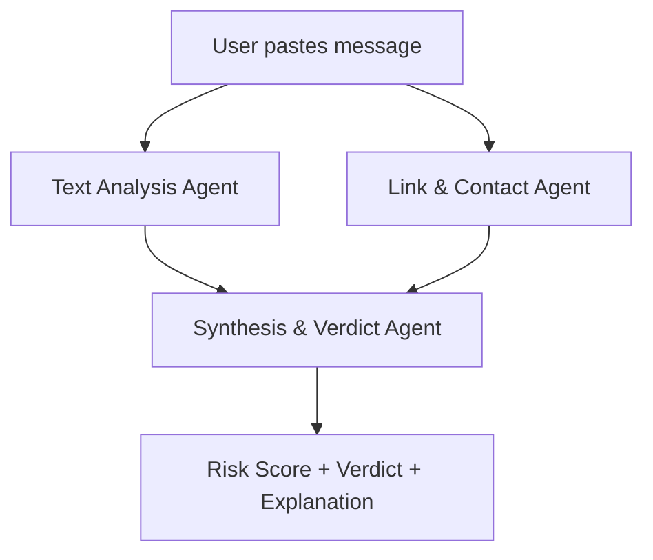

#  Is This a Scam?" Message Analyzer

---

## 🎯 Target Audience

* General public (especially non-tech-savvy users)
* Elderly users or caregivers
* Schools, NGOs, and consumer safety initiatives
* Cyber awareness programs

---

## 💡 Core Concept

A user receives a **suspicious message** via SMS, email, WhatsApp, or social media. They paste it into this tool. A team of intelligent agents analyzes the text and any included links to provide an instant **scam risk score** and a **clear, plain-English explanation** of the decision.

---

## 🛡️ Primary Objective

To **empower everyday users** with a fast, reliable second opinion on suspicious messages using AI. The goal is to reduce scam victims by making scam detection **as easy as pasting a message** into a box.

---

## ⚠️ Problem Statement

Scam messages are:

* Designed to create **urgency** or **fear**
* Written to **impersonate** trusted services
* Becoming increasingly sophisticated

Many people cannot distinguish real alerts from well-crafted frauds. Even cautious users fall victim due to the emotional manipulation embedded in these messages.

---

## 🧠 The Multi-Agent Team: Roles and Responsibilities

### 🧠 1. **Text Analysis Agent** – *The Psychologist*

* **Role**: Analyze message tone and structure
* **Capabilities**:

  * Identify scam tactics:

    * Urgency or threats ("Click now or account will be locked")
    * Emotional manipulation (guilt, fear, reward)
    * Common phishing patterns
    * Grammar and spelling errors
* **Tech**: Uses an LLM (e.g., GPT-4 via Amazon Bedrock) with a social engineering prompt

---

### 🕵️ 2. **Link & Contact Agent** – *The Detective*

* **Role**: Investigate URLs, phone numbers, emails
* **Capabilities**:

  * Extract all links, phone numbers, and email addresses using regex
  * Flag common scam signals:

    * Shortened URLs (e.g., bit.ly)
    * Unusual domains
    * Links impersonating brands (e.g., apple.support-reset.com)
  * (Optional extension): Use Use Cases 23, 28, or 30 for reputation checking
* **Tech**: Regex, URL resolvers, reputation APIs (VirusTotal, AbuseIPDB)

---

### ⚖️ 3. **Synthesis & Verdict Agent** – *The Judge*

* **Role**: Weigh all findings and communicate with clarity
* **Capabilities**:

  * Merge findings from both other agents
  * Generate a color-coded **risk score (e.g., 0–100%)**
  * Deliver an **easy-to-understand explanation** (no jargon!)
  * Example:

    > "Verdict: 🚨 VERY LIKELY A SCAM (98%)
    > Why:
    >
    > * Uses urgent, threatening language ('IMMEDIATELY')
    > * Contains spelling mistakes ('acct', 'pymnt')
    > * Link is shortened (bit.ly), and not from your bank"

---

## 🧰 Agent Toolkit: Associated Tools and Technologies

| Agent                | Tools / APIs Used                                     |
| -------------------- | ----------------------------------------------------- |
| Text Analysis Agent  | Amazon Bedrock (Claude / GPT-4)                       |
| Link & Contact Agent | Regex extractor, optional link resolvers + VirusTotal |
| Verdict Agent        | LLM prompt with conditional logic & risk scoring      |

---

## 👤 Workflow from the User's Perspective

### 🧵 Sample User Flow:

**Step 1**: User receives a text:

> "Mssg from Bank: A pymnt of \$500 was made from your acct. If this was NOT you, click here IMMEDIATELY to cancel: [http://bit.ly/bank-cancel-help](http://bit.ly/bank-cancel-help)"

**Step 2**: They open the **“Is This a Scam?”** web app and paste the message.

**Step 3**: In seconds, they get a **result**:

```markdown
🚨 Verdict: VERY LIKELY A SCAM (Risk Score: 98%)

**Why?**
- Uses urgency and fear tactics ("IMMEDIATELY", "cancel")
- Poor grammar/spelling ("Mssg", "acct", "pymnt")
- Link is a shortened URL (bit.ly), not your bank's actual domain
- This pattern matches known phishing attempts

✅ Recommendation:
- Do NOT click the link
- Report the message as spam
- If worried, contact your bank directly using official channels
```

---

## 🔧 Technical Deep Dive: The Developer’s Perspective

### 🧠 Prompt Design for Text Analysis Agent

```text
System Prompt:
"You are a security expert trained to detect scam messages. Analyze the following message and identify if it contains any common scam tactics (e.g., urgency, fake threats, unrealistic offers, poor spelling, impersonation of trusted brands). Return a 0–100 scam likelihood score, and explain your reasoning in bullet points."
```

### ⚙️ Backend Flow



### 🧪 Risk Scoring Logic

```python
def get_risk_score(text_score, link_score):
    weighted_score = (0.6 * text_score) + (0.4 * link_score)
    return round(weighted_score)
```

---

## 🧪 Data Sources for Prototyping and Testing

* **Scam examples**:

  * Reddit: [r/Scams](https://www.reddit.com/r/Scams/)
  * PhishTank
  * Email/SMS spam folders
* **Legitimate examples**:

  * Real alerts from Apple, banks, Google, Amazon
  * Test for **false positives** to tune prompts

---

## 🚀 Hackathon Viability

| Criteria              | Rating                                     |
| --------------------- | ------------------------------------------ |
| **Impactful**         | ⭐⭐⭐⭐⭐ – Real-world, daily problem solver   |
| **Beginner Friendly** | ⭐⭐⭐⭐ – Clear modular design, LLM + regex   |
| **Demo Power**        | ⭐⭐⭐⭐⭐ – Paste → Result → Trust             |
| **LLM Utility**       | ⭐⭐⭐⭐⭐ – Great fit for LLM interpretability |
| **Public Good**       | ⭐⭐⭐⭐⭐ – Protects vulnerable users          |

---
