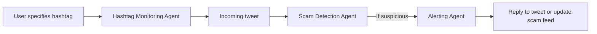

# Live Event Hashtag Scam Monitor

---

## 🎯 Target Audience

* **General public**
* **Event attendees**
* **Brands and event organizers**
* **Online safety advocates**
* **Security researchers**

---

## 💡 Core Concept

This tool monitors **real-time social media posts** using a user-specified **hashtag for a live event** (e.g., `#SuperBowlLive`, `#WWDC25`). It analyzes incoming posts to detect **scams, spam, and phishing attempts**, especially those exploiting excitement, urgency, and high traffic.

Posts like:

> "🎁 FREE TICKETS to #WWDC25 – click now 👉 scam-link.bit.ly"

...are instantly flagged and shown on a **public alert feed** or automatically replied to with a scam warning.

---

## 🛡️ Primary Objective

To protect users engaged in **high-traffic event hashtags** from falling for:

* Fake giveaways
* Malicious live-stream links
* Phishing contests
* Crypto scams

Scammers know users will be searching these hashtags—this tool ensures they won’t become easy prey.

---

## ⚠️ Problem Statement

Live events attract massive attention—and scammers exploit this by flooding event hashtags with:

* Fake streaming links
* Contests asking for personal details
* Suspicious URLs (bit.ly, scam.site, etc.)
* Bots impersonating brands

This creates **trust erosion**, **user harm**, and **event reputation damage**.

---

## 🧠 The Multi-Agent Team: Roles and Responsibilities

### 📡 1. **Hashtag Monitoring Agent**

* **Role**: Real-time data fetcher
* **Task**: Connects to the **X (Twitter) streaming API** to collect all posts containing the **target hashtag**.
* **Example**: Monitors `#SuperBowlLive`, pulling new tweets the moment they're posted.

---

### 🕵️‍♂️ 2. **Scam Detection Agent**

* **Role**: Rule-based detection engine
* **Task**:

  * Check tweet content against **scam keywords**: `["free", "giveaway", "streaming", "win now", "limited offer"]`
  * Identify **suspicious links** (shortened URLs, unusual domains)
  * Analyze **poster account reputation**:

    * `followers_count < 10`
    * `account_age < 1 day`
    * `profile_picture == default`

---

### 🚨 3. **Alerting Agent**

* **Role**: Public noticer
* **Task**:

  * If a tweet is flagged:

    * Option 1: Post an **automated public reply**:

      > ⚠️ Caution: This post may be a scam. Please don’t click links from unknown accounts.
    * Option 2: Add it to a **"Scam Feed"** for moderators or users to review in real time.

---

## 🧰 Agent Toolkit: Associated Tools and Technologies

| Agent                    | Tools / APIs Used                                              |
| ------------------------ | -------------------------------------------------------------- |
| Hashtag Monitoring Agent | **X/Twitter Streaming API**                                    |
| Scam Detection Agent     | **Keyword list**, **regex for links**, account metrics via API |
| Alerting Agent           | **X/Twitter Post or Reply API**                                |

---

## 👤 Workflow from the User's Perspective

### 🎯 Scenario:

* It's the day of the Super Bowl.
* A user starts the tool with hashtag: `#SuperBowlLive`
* The tool begins monitoring the feed.

### 📩 Example Tweet (real-time):

```text
"FREE 4K LIVE STREAM of the #SuperBowlLive here 👉 http://bit.ly/suspicious-link"
```

### ✅ Tool Response:

```markdown
⚠️ Scam Alert Detected!
- Account: @ScamBot123 (2 followers, created today)
- Keywords: "FREE", "LIVE STREAM"
- Link: http://bit.ly/suspicious-link

Recommendation: Avoid clicking. Report this account if possible.

(Added to Public Scam Feed)
```

---

## 🔧 Technical Deep Dive: Developer’s Perspective

### 🔁 Architecture Overview



---

### 🧠 Detection Logic (Pseudocode):

```python
SCAM_KEYWORDS = ["free", "giveaway", "stream", "win now", "exclusive link"]
SHORTENERS = ["bit.ly", "tinyurl", "ow.ly", "is.gd"]

def is_scam(tweet):
    score = 0
    
    if any(keyword in tweet.text.lower() for keyword in SCAM_KEYWORDS):
        score += 1
    if any(short in tweet.text.lower() for short in SHORTENERS):
        score += 1
    if tweet.user.followers_count < 10 or tweet.user.account_age_days < 1:
        score += 1

    return score >= 2
```

---

## 🧪 Data Sources for Prototyping and Testing

* Use **Twitter/X Trending Hashtags**

  * e.g., `#WWDC25`, `#FIFA2025`, `#OscarsLive`, `#OnePlusLaunch`
* Scan posts manually and tag known scams to test accuracy.
* Use **bit.ly**, **scamsite.net**, or dummy phishing links for test cases.

---

## 🚀 Hackathon Viability

| Criteria               | Evaluation                                                  |
| ---------------------- | ----------------------------------------------------------- |
| **Real-time Use Case** | ⭐⭐⭐⭐⭐ – Connects to actual live data                        |
| **Social Impact**      | ⭐⭐⭐⭐⭐ – Prevents harm in highly vulnerable moments          |
| **Beginner-Friendly**  | ⭐⭐⭐⭐ – Simple logic, low-code, real-world APIs              |
| **Demo Power**         | ⭐⭐⭐⭐⭐ – Can show real-time alerts during the hackathon demo |
| **Expandability**      | ⭐⭐⭐⭐ – Can extend to Instagram, YouTube, Reddit             |

---
