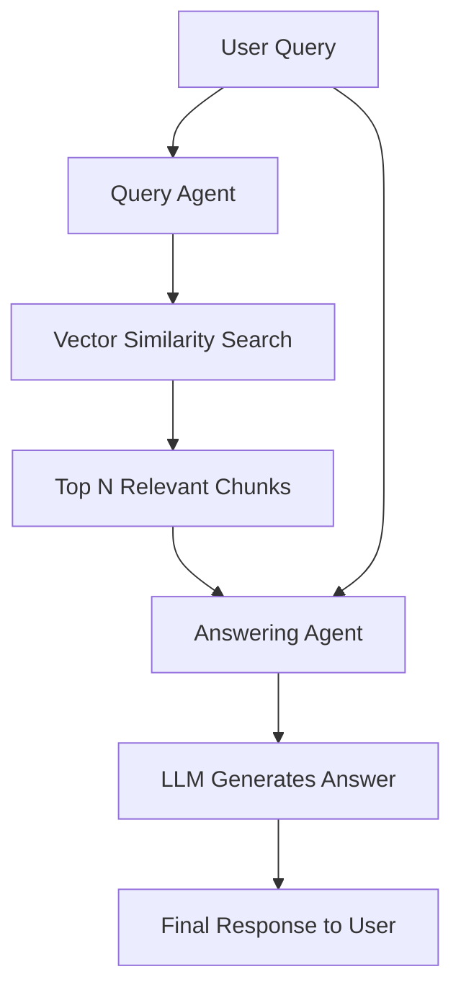

# Security Glossary Chatbot

---

## 🎯 Target Audience

* Cybersecurity beginners and students
* IT professionals and legal teams adjacent to security
* Corporate training teams
* Non-technical stakeholders trying to navigate infosec concepts

---

## 💡 Core Concept

A simple chatbot that serves as an **interactive cybersecurity dictionary**.
Users can ask natural language questions like:

* “What is EDR?”
* “Explain zero-day vulnerability.”
* “Difference between virus and worm?”

The chatbot provides **clear, friendly, and accurate answers** drawn from a curated knowledge base.

---

## 🛡️ Primary Objective

To **demystify cybersecurity jargon** and make technical language more accessible.
The chatbot acts as an always-available **learning companion** to reduce the cognitive barrier for:

* Newcomers
* Cross-functional collaborators
* Students preparing for exams or certifications

---

## ⚠️ Problem Statement

Cybersecurity is notoriously acronym-heavy (e.g., SIEM, SOC, EDR, XDR, CVSS...).
This **linguistic overload** can:

* Frustrate beginners
* Create miscommunication across teams
* Hinder learning and project collaboration

There is a need for a **lightweight, reliable, context-aware chatbot** that explains these terms instantly and clearly.

---

## 🧠 The Multi-Agent Team: Roles and Responsibilities

### 📚 1. **Knowledge Ingestion Agent** – *The Librarian (Offline)*

* Reads glossary documents, articles, and definitions
* Splits content into chunks and creates vector embeddings
* Stores data in a **vector database** (e.g., ChromaDB, FAISS)

---

### 🔍 2. **Query Agent** – *The Retriever (Online)*

* Receives user input (e.g., “What is a zero-day vulnerability?”)
* Converts query to vector embedding
* Performs **similarity search** on the vector store
* Retrieves the most relevant chunks of context

---

### 🧠 3. **Answering Agent** – *The Explainer*

* Feeds the **original user query + retrieved chunks** into an LLM (e.g., Bedrock Claude, GPT-3.5-Turbo)
* Generates a **final, simplified** answer using the given context
* Returns a clean, user-friendly explanation

---

## 🧰 Agent Toolkit: Associated Tools and Technologies

| Agent               | Tools and Technologies Used                                               |
| ------------------- | ------------------------------------------------------------------------- |
| Knowledge Ingestion | LangChain / LlamaIndex, text splitter, embedding model, FAISS or ChromaDB |
| Query Agent         | Same embedding model as ingestion for consistency                         |
| Answering Agent     | LLM API (e.g., Amazon Bedrock Claude or OpenAI GPT-3.5)                   |

---

## 👤 Workflow from the User's Perspective

1. User visits a chatbot interface.
2. They type:
   `"What is a zero-day vulnerability?"`
3. The chatbot responds:

   > **Zero-Day Vulnerability:** A security flaw that is known to attackers but not yet patched by the software vendor. It's called "zero-day" because developers have had zero days to fix it before it's exploited.

---

## 🔧 Technical Deep Dive: Developer's Perspective

### Offline (Ingestion Phase):

* Load documents from NIST, SANS, Wikipedia, internal glossaries, etc.
* Split text into semantically meaningful chunks (100–300 tokens each)
* Embed each chunk using an embedding model (e.g., `all-MiniLM-L6-v2`)
* Store vectors + metadata in FAISS or ChromaDB

### Online (Query Phase):



---

### Prompt Example for LLM (Answering Agent)

```text
System Prompt:
You are a helpful cybersecurity glossary assistant. Using only the context below, answer the user's question in clear, simple terms.
If no relevant context exists, say: "Sorry, I don't have information on that yet."

User Question: What is a zero-day vulnerability?

Context:
- A zero-day vulnerability is a flaw in software that is not yet known to the vendor.
- It is called "zero-day" because there are zero days between discovery and active exploitation.
```

---

## 🧪 Data Sources for Prototyping and Testing

* [NIST Glossary](https://csrc.nist.gov/glossary)
* [SANS Glossary](https://www.sans.org/cyber-security-glossary/)
* Wikipedia (e.g., [https://en.wikipedia.org/wiki/Computer\_security](https://en.wikipedia.org/wiki/Computer_security))
* OWASP terms and cheat sheets
* Custom enterprise glossaries (for internal use)

---

## 🚀 Hackathon Viability

| Criteria           | Rating                                             |
| ------------------ | -------------------------------------------------- |
| **Learning Value** | ⭐⭐⭐⭐⭐ – RAG fundamentals                           |
| **Usefulness**     | ⭐⭐⭐⭐⭐ – Extremely helpful to public                |
| **Time to Build**  | ⭐⭐⭐⭐ – Quick to build MVP with prebuilt tools      |
| **Scalability**    | ⭐⭐⭐ – Add more terms over time                     |
| **Demo Friendly**  | ⭐⭐⭐⭐⭐ – Works great in a browser with clear impact |

---
