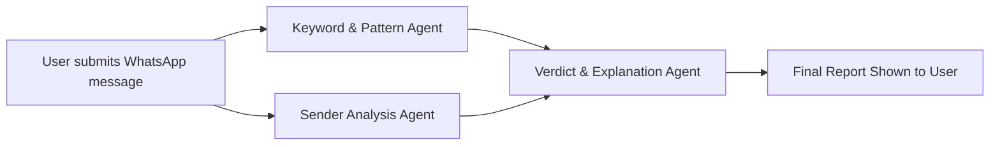

# WhatsApp "Part-Time Job" Scam Analyzer

---

## 🎯 Target Audience

* **General Public**
* **Job Seekers**
* **Students & Freelancers**
* **Digital Safety Educators**

---

## 💡 Core Concept

This is a **targeted scam detection tool** where users can paste a **suspicious WhatsApp message** offering a part-time job that sounds “too good to be true.” The system uses a specialized agent trained on known patterns of WhatsApp job scams and provides an **instant verdict and clear explanation** of the fraud.

---

## 🛡️ Primary Objective

To **protect vulnerable users** from “task-based” WhatsApp job scams by:

* Identifying common scam patterns in real-time
* Explaining the exact method the scammers use
* Empowering users with actionable safety advice

---

## ⚠️ Problem Statement

As of 2024–2025, one of the most prevalent scam types involves WhatsApp messages from **unknown international numbers** offering:

* “Easy part-time work”
* “Daily income between \$100–\$500”
* Tasks like “liking YouTube videos” or “rating hotel listings”
* Fake HR managers and Telegram mentors

These scams often start with a small payout to gain the victim’s trust before escalating into **advance-fee fraud**, where the victim is pressured to invest their own money and ultimately loses it.

---

## 🧠 The Multi-Agent Team: Roles and Responsibilities

### 🔍 1. **Keyword and Pattern Agent**

* **Role**: First-pass filter
* **Task**: Scans the message for a **predefined list of scam-related phrases**.
* **Examples of scam indicators**:

  * `"part-time job"`, `"daily salary"`, `"easy tasks"`, `"200 USD per day"`, `"Telegram mentor"`, `"join now"`, `"HR recruiter"`

---

### 📱 2. **Sender Analysis Agent**

* **Role**: Country code validation
* **Task**: Extracts the sender’s phone number (if provided) and:

  * Checks if the number is from a **high-risk country**
  * Flags suspicious international codes (e.g., `+63`, `+62`, `+234`)

---

### 🧠 3. **Verdict & Explanation Agent**

* **Role**: Final output generator
* **Task**:

  * Combines results from the Keyword and Sender Agents
  * If scam confidence is high, uses an **LLM (e.g., GPT-3.5-Turbo or Bedrock Claude)** to synthesize:

    * The verdict
    * Explanation of the scam method
    * Final user recommendation

---

## 🧰 Agent Toolkit: Tools and Technologies

| Agent                 | Tool/Tech Used                               |
| --------------------- | -------------------------------------------- |
| Keyword/Pattern Agent | Python script with `set.intersection()`      |
| Sender Analysis Agent | Phone prefix checker using a local mapping   |
| Verdict Agent         | LLM with structured prompt (Bedrock/GPT-3.5) |

---

## 👤 Workflow from the User's Perspective

### Example Message:

> "Hi, I am hiring manager from Global HR. We offer a part-time job rating Google Maps listings for \$200/day. Contact our mentor on Telegram: @EarnTaskToday"

### User Action:

* Copies and pastes the message into the scam analyzer tool.

### System Response:

```markdown
🚨 **Warning: This is a Textbook Job Scam!**

---

### ❗ Scam Triggers Detected:
- Keywords: "part-time job", "200/day", "Telegram mentor", "HR"
- Sender: International number with suspicious prefix (+63)

---

### 🧠 How This Scam Works:
Scammers will first ask you to do simple tasks like rating or subscribing and might even pay a small amount to build trust. Then they’ll ask you to complete a "premium" task that requires you to **send money**—which you’ll never get back.

---

### ✅ Recommendation:
Do not contact the "mentor", **block this number**, and report it to WhatsApp immediately.

```

---

## 🔧 Technical Deep Dive: Developer’s Perspective

### 📋 Architecture Flow:



### 📌 Decision Logic (Pseudocode):

```python
if keyword_score >= threshold or sender_flagged:
    trigger_verdict_agent = True
else:
    trigger_verdict_agent = False
```

---

## 🧪 Data Sources for Prototyping and Testing

* 📂 **r/scams Subreddit** – real-world messages and screenshots
* 📂 **ScamAdviser**, **Malwarebytes Labs**, **Cyber Crime Portals**
* 📂 **Telegram Groups and Archived Reports**

---

## 🚀 Hackathon Viability

| Criteria             | Evaluation                                         |
| -------------------- | -------------------------------------------------- |
| **Feasibility**      | ⭐⭐⭐⭐⭐ – Rule-based and easy to implement           |
| **Impact**           | ⭐⭐⭐⭐⭐ – Addresses a real and current global threat |
| **Complexity Level** | ⭐⭐ – Low to moderate (ideal for beginners)         |
| **Demo Value**       | ⭐⭐⭐⭐⭐ – Generates immediate, understandable impact |
| **Scalability**      | ⭐⭐⭐⭐ – Can expand to SMS, Instagram scams, etc.    |

---
