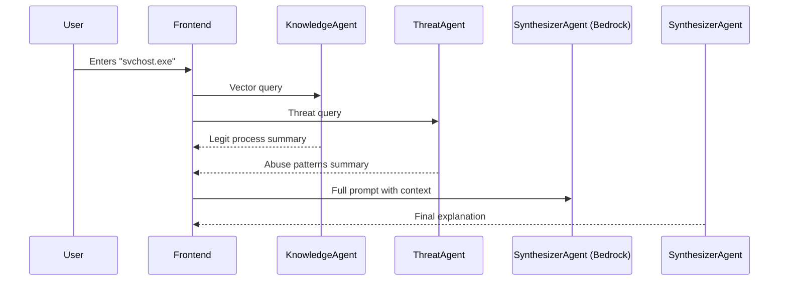

---

# “What Is This Process?” – Task Manager Explainer

## 🎯 Target Audience

* **Non-technical users**
* **Cybersecurity beginners**
* **Concerned home users**
* **Corporate helpdesk triage tools**
* **Educational digital literacy apps**

---

## 💡 Core Concept

When users open Task Manager (Windows) or Activity Monitor (macOS), they often see **cryptic process names** like `svchost.exe`, `rundll32.exe`, or `mdnsresponder`. These may look suspicious—but could be completely normal. However, malware also **impersonates or hijacks** these processes to avoid detection.

This tool allows users to **type in a process name and get a clear, non-technical explanation** about:

1. What the process *normally* does
2. How it *might be abused by malware*

---

## 🧭 Primary Objective

To **demystify background system processes**, helping everyday users confidently distinguish between:

* Normal system activity
* Potential malware impersonation

All without needing to understand low-level operating system internals or perform manual research.

---

## ⚠️ Problem Statement

Looking at the process list on a system can feel overwhelming. Standard web searches return conflicting or overly technical results. Users need:

* **Clarity**
* **Trust**
* **Context**

This tool fills that gap by using a **retrieval-augmented generation (RAG)** architecture with multiple AI agents collaborating to generate balanced insights.

---

## 🤖 The Multi-Agent Team: Roles and Responsibilities

### 🧩 1. **Knowledge Retrieval Agent**

* **Role**: Fetches information about the **legitimate** purpose of the entered process.
* **Data Source**: A **vector database (e.g., ChromaDB)** built from trustworthy articles and documentation (e.g., Microsoft, How-To Geek).
* **Input**: `"svchost.exe"`
* **Output**: Plain-language explanation of the process’s intended role.

---

### 🕵️ 2. **Threat Context Agent**

* **Role**: Investigates **how the same process name may be used maliciously**.
* **(Web search optional for MVP — assume offline threat dataset or prompt library)**
* **Simulated Input**: `"svchost.exe malware usage"`
* **Output**: Common threat patterns like:

  * Fake `svchost.exe` running from `C:\Users\Temp`
  * CPU spikes from injected payloads
  * Persistence via registry hooks

---

### 🧠 3. **Explanation Synthesizer Agent**

* **Role**: Uses a **Bedrock Agent (LLM)** to combine both inputs and produce a **clear, two-part answer**:

  * ✅ What this process normally is
  * ⚠️ How it may be exploited

---

## 🧰 Agent Toolkit: Associated Tools and Technologies

| Agent                     | Technology Used                                  |
| ------------------------- | ------------------------------------------------ |
| Knowledge Retrieval Agent | Vector DB (e.g., ChromaDB, FAISS)                |
| Threat Context Agent      | Static knowledge base or search snippets         |
| Explanation Synthesizer   | Amazon Bedrock (e.g., Claude or GPT-4 via Agent) |

---

## 👤 Workflow from the User's Perspective

1. **User Action**: Types `"svchost.exe"` into the tool.
2. **Knowledge Agent** retrieves system-level info.
3. **Threat Agent** finds how malware mimics it.
4. **Synthesizer Agent** returns a clean response:

### 🧾 Example Output:

```markdown
# 🔍 Process: svchost.exe

## ✅ What It Is (Normally)
`svchost.exe` stands for **Service Host**. It is a legitimate and critical Windows system process used to run other background services. You will often see multiple instances running simultaneously.

## ⚠️ Security Threat Intel
Malware often hides by naming itself `svchost.exe`. Warning signs include:
- The process running from outside `C:\Windows\System32`
- Unusually high or sustained CPU/network activity
- No associated services

🛡️ Tip: Always check the file location and digital signature if unsure.
```

---

## 🔧 Technical Deep Dive: Developer’s Perspective



---

## 🔬 Hackathon Viability

| Criteria                 | Evaluation                                                |
| ------------------------ | --------------------------------------------------------- |
| **Buildability**         | ⭐⭐⭐⭐⭐ – Straightforward 3-agent RAG setup                 |
| **Usefulness**           | ⭐⭐⭐⭐⭐ – Everyday problem with no great existing tool      |
| **AI Fit**               | ⭐⭐⭐⭐⭐ – RAG + summarization = perfect use case            |
| **Demo Potential**       | ⭐⭐⭐⭐ – Highly visual, explainable tool for judging panels |
| **Initial Dataset Size** | ⭐⭐⭐⭐⭐ – Just 10–20 process entries to start MVP           |

---

## 🧪 Data Sources for Prototyping and Testing

* 🧾 **Microsoft Docs** – [Processes and Services](https://learn.microsoft.com/)
* 🧾 **How-To Geek** – Simple tech explainers
* 🧾 **BleepingComputer** – Malware behavior and abuse cases
* 🧾 **Malwarebytes Labs** – Malware trends and threat intelligence

💡 You can easily start by opening **Task Manager** on your machine and noting the top 20 common processes.

---

